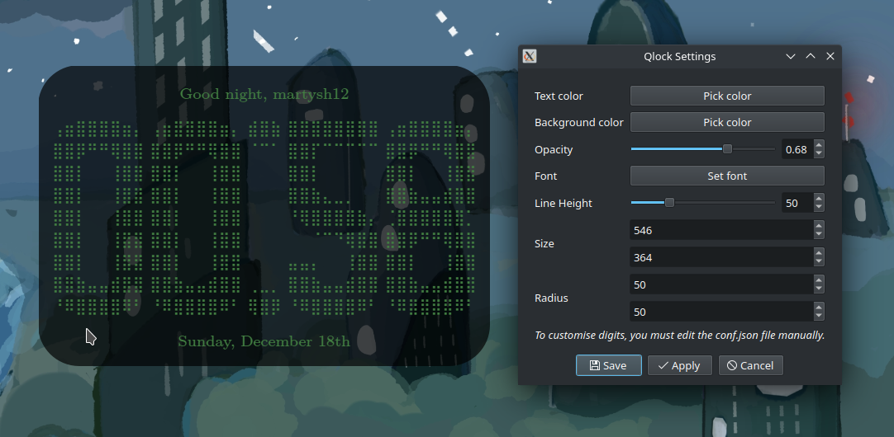

# Qlock
Cool ASCII clock written in PyQT6

## Usage

### Running

```sh
$ python3 main.py
```

## Features
### Fully customisable
 - Lots of settings you can adjust.

### Config updates in real-time
 - Any changes to the config file (`conf.json`) will be reflected in the interface.

### Qt-based
 - The interface will adjust to themes you have installed on your computer.

## Gallery


